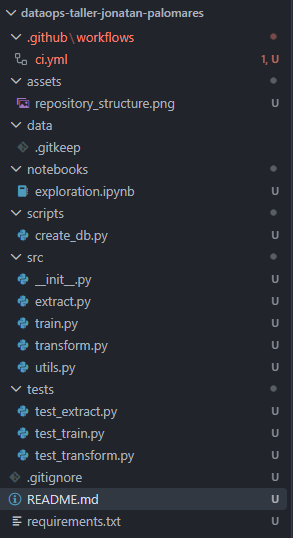

# Taller DataOps Tercio 2
**Estudiante: Jonatan Palomares Castañeda**

## Descripción del proyecto
Este repositorio es un taller para la asignatura de Enfoque DataOps. Durante el taller se asume el rol de Ingeniero DataOps en un equipo de ciencia de datos. Se debe diseñar, implementar y documentar un pipeline de CI/CD para un proyecto de datos simulado.

### Contexto de negocio
Una tienda en línea quiere implementar un pipeline de datos que: 
1. Extraiga datos de ventas desde una base de datos PostgreSQL (simulada). 
2. Limpie y transforme los datos (eliminar duplicados, manejar valores nulos, calcular métricas como ventas totales por categoría). 
3. Entrene un modelo simple de machine learning (por ejemplo, regresión lineal para predecir ventas del próximo mes). 
4. Genere un reporte en formato CSV o dashboard simple. 
5. Se ejecute automáticamente cada vez que haya un nuevo commit en la rama principal. 

## Instrucciones de instalación

## Estructura del repositorio

## Comandos básicos de Git utilizados
Los principales comandos de Git utilizados son:
- `git init`
- `git add -A`
- `git commit`
- `git commit -m "..."`
- `git switch -c <branch_name>`
- `git switch <branch_name>`
- `git branch`
- `git push`
- `git pull`
- `git merge <branch_name>`