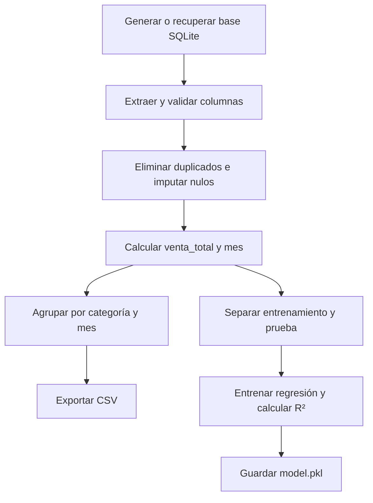
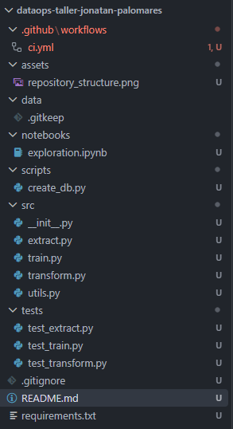
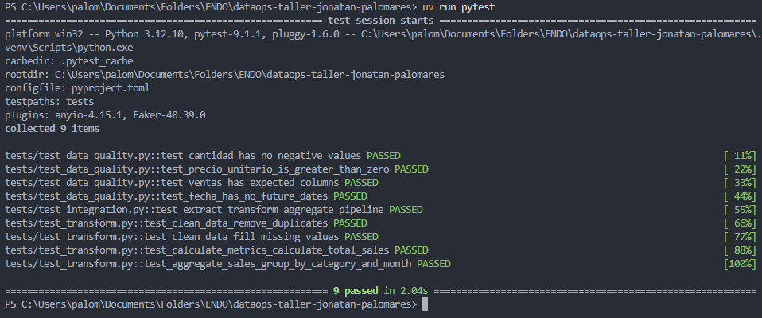
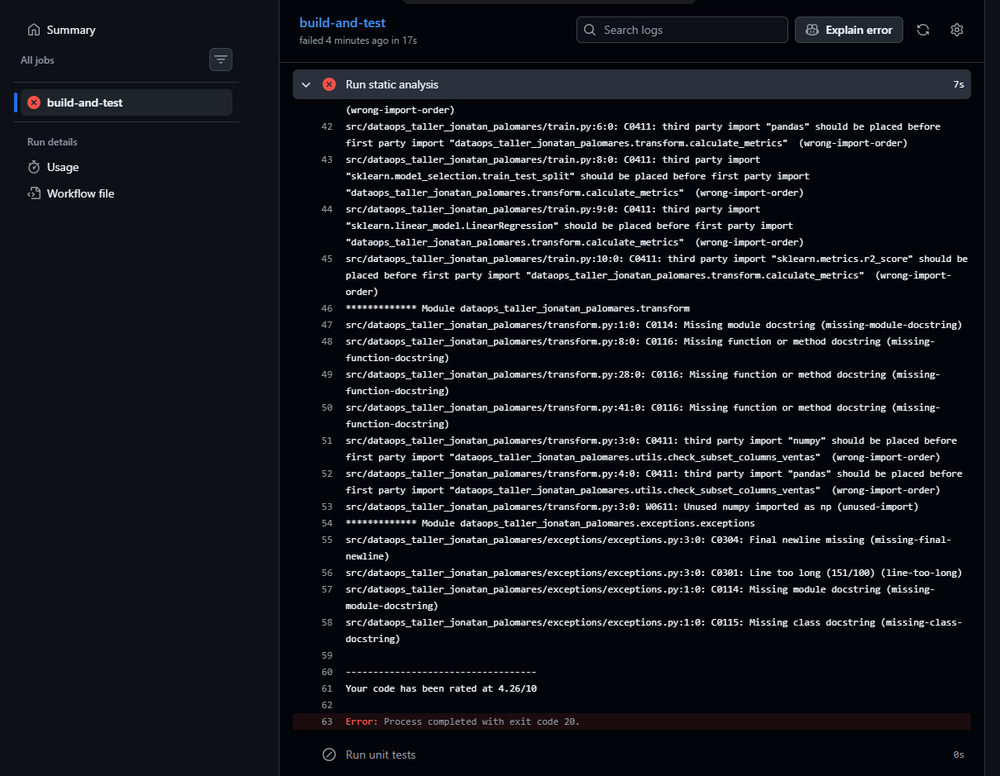
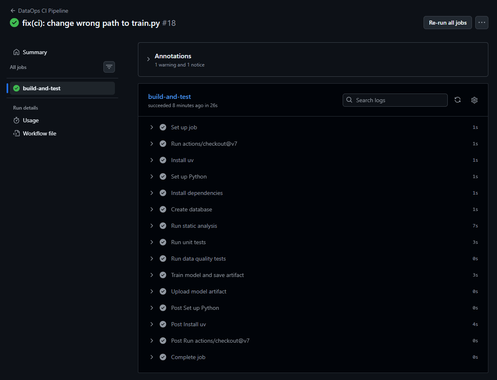
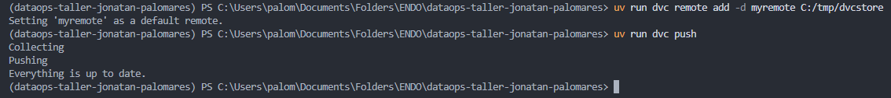
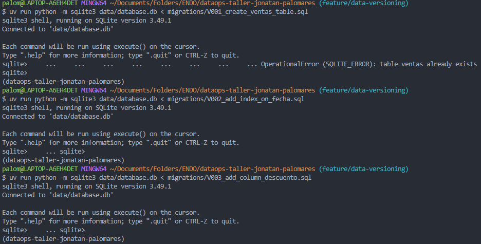
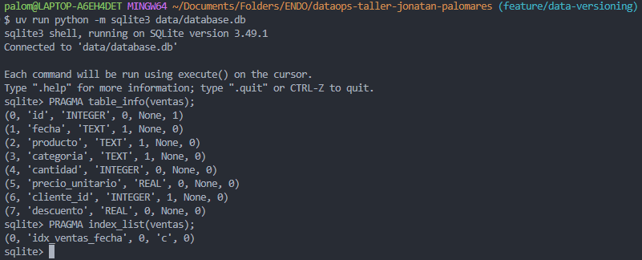

# Taller DataOps: pipeline de datos para una tienda en línea

**Estudiante:** Jonatan Palomares Castañeda  
**Asignatura:** Enfoque DataOps — Escuela Colombiana de Ingeniería Julio Garavito  
**Repositorio:** [dataops-taller-jonatan-palomares](https://github.com/PalomaresJonatan13/dataops-taller-jonatan-palomares)

## Contenido

1. [Introducción y alcance](#1-introducción-y-alcance)
2. [Diseño y funcionamiento del pipeline](#2-diseño-y-funcionamiento-del-pipeline)
3. [Estructura del repositorio](#3-estructura-del-repositorio)
4. [Instalación y ejecución local](#4-instalación-y-ejecución-local)
5. [Desarrollo e historial de cambios](#5-desarrollo-e-historial-de-cambios)
6. [Pruebas y resultados](#6-pruebas-y-resultados)
7. [Integración continua con GitHub Actions](#7-integración-continua-con-github-actions)
8. [Versionamiento de datos, migraciones y snapshots](#8-versionamiento-de-datos-migraciones-y-snapshots)
9. [Decisiones de diseño y análisis](#9-decisiones-de-diseño-y-análisis)
10. [Reflexión: 10 TB de datos y 20 científicos de datos](#10-reflexión-10-tb-de-datos-y-20-científicos-de-datos)
11. [Declaración de uso de inteligencia artificial](#11-declaración-de-uso-de-inteligencia-artificial)
12. [Referencias](#12-referencias)

## 1. Introducción y alcance

El objetivo del taller es aplicar prácticas DataOps a un proyecto simulado: desarrollar un pipeline de ventas, controlar los cambios con Git, comprobar la calidad del código y de los datos, automatizar verificaciones y conservar versiones de los datos y del esquema.

El caso representa una tienda en línea que necesita extraer ventas, limpiarlas, calcular indicadores, agregarlas por categoría y mes y entrenar una regresión lineal sencilla. Se utiliza SQLite y datos sintéticos.

## 2. Diseño y funcionamiento del pipeline

### Flujo lógico de los módulos

El siguiente diagrama representa las operaciones disponibles. No se implementó ningún orquestador para el pipeline.


```mermaid
flowchart TD
    A[Generar o recuperar base SQLite] --> B[Extraer y validar columnas]
    B --> C[Eliminar duplicados e imputar nulos]
    C --> D[Calcular venta_total y mes]
    D --> E[Agrupar por categoría y mes]
    D --> F[Separar entrenamiento y prueba]
    E --> G[Exportar CSV]
    F --> H[Entrenar regresión y calcular R²]
    H --> I[Guardar model.pkl]
```

### Datos de entrada

`scripts/create_db.py` crea `data/database.db` y la tabla `ventas`. Cada ejecución inserta **200 registros adicionales**. Utiliza `Faker` y `random`, ambos con semilla 42, y cinco categorías: `Technology`, `Clothing`, `Home`, `Toys` y `Food`.

| Columna | Tipo SQLite | Restricción inicial | Uso |
| --- | --- | --- | --- |
| `id` | INTEGER | Clave primaria autoincremental | Identificación del registro. |
| `fecha` | TEXT | NOT NULL | Fecha de venta; se convierte a datetime. |
| `producto` | TEXT | NOT NULL | Producto. |
| `categoria` | TEXT | NOT NULL | Categoría del producto.. |
| `cantidad` | INTEGER | Admite NULL | Cantidad vendida. |
| `precio_unitario` | REAL | Admite NULL | Precio del producto. |
| `cliente_id` | INTEGER | NOT NULL | Identificador ficticio del cliente. |

El generador introduce duplicados con probabilidad del 3 % y nulos con probabilidad del 3 % en cada una de las variables `cantidad` y `precio_unitario`. Son probabilidades de generación, no porcentajes garantizados en cada muestra.

### Operaciones implementadas

| Archivo y función | Comportamiento |
| --- | --- |
| `extract.py`: `extract_data(db_path)` | Consulta `SELECT * FROM ventas`, construye un DataFrame y verifica las columnas requeridas. Acepta `str` o `Path`. |
| `utils.py`: `check_subset_columns_ventas(df)` | Comprueba que las siete columnas originales estén presentes. Permite columnas adicionales, como `descuento`; lanza `WrongDBColumnsException` si faltan columnas. |
| `transform.py`: `clean_data(df)` | Elimina duplicados considerando todas las columnas excepto `id`; rellena cantidad con 0 y precio con la media posterior a la deduplicación; convierte fecha a datetime. |
| `transform.py`: `calculate_metrics(df)` | Llama a la limpieza y añade `venta_total = cantidad * precio_unitario` y `mes = fecha.dt.month`. |
| `transform.py`: `aggregate_sales(df)` | Calcula las métricas y suma `venta_total` por `categoria` y `mes`. |
| `train.py`: `train_model(df)` | Calcula métricas, separa 80 % para entrenamiento y 20 % para prueba con `random_state=42`, ajusta `LinearRegression`, calcula $R^2$ de prueba y guarda el modelo con joblib. Devuelve un diccionario con `model` y `r2`. |
| `utils.py`: `save_to_csv(df, path)` | Exporta el DataFrame recibido sin índice. La carpeta de destino debe existir. |


## 3. Estructura del repositorio

| Ruta | Contenido o responsabilidad |
| --- | --- |
| `.github/workflows/ci.yml` | Automatización de análisis estático, pruebas y publicación del archivo del modelo. |
| `.dvc/`, `.dvcignore` | Configuración de DVC. |
| `data/database.db.dvc` | Metadatos de la base versionada: hash, tamaño y ruta. |
| `scripts/create_db.py` | Creación y población de la base. |
| `scripts/create_snapshots.py` | Copia fechada de la base de datos. |
| `src/dataops_taller_jonatan_palomares/` | Paquete con extracción, transformación, entrenamiento, utilidades y excepciones. |
| `tests/` | Pruebas unitarias, de calidad y de integración. |
| `migrations/` | Scripts V001, V002 y V003. |
| `notebooks/exploration.ipynb` | Análisis exploratorio. |
| `models/model.pkl` | Archivo de modelo presente en Git. |
| `assets/` | Capturas de evidencia. |
| `pyproject.toml`, `uv.lock`, `.python-version` | Dependencias, configuración de herramientas y versión de Python. |
| `.gitignore` | Exclusiones de datos, entornos, secretos y cachés. |

La base `.db`, los CSV y los snapshots se generan o recuperan localmente; sus contenidos no se incluyen directamente en Git.



*Figura 1. Estructura inicial. Es una captura histórica: posteriormente los módulos se movieron al paquete dentro de `src/` y la gestión de dependencias pasó a uv. La tabla anterior describe la estructura final.*

## 4. Instalación y ejecución local

### 4.1. Preparar el entorno

Requisitos: Git, uv y Python 3.12. El proyecto declara Python `>=3.12`, fija `3.12` en `.python-version` y usa esa versión en CI. No se necesita instalar un servidor PostgreSQL.

```bash
git clone https://github.com/PalomaresJonatan13/dataops-taller-jonatan-palomares.git
cd dataops-taller-jonatan-palomares
uv sync --locked
```

`uv sync` instala el paquete del proyecto y las dependencias de desarrollo. Aquí se añade `--locked` para exigir coherencia con el lockfile existente [1]. No es necesario activar manualmente el entorno al usar `uv run`.

Todos los comandos siguientes se ejecutan desde la raíz del repositorio, salvo indicación contraria.

### 4.2. Disponer de los datos

**Para una primera ejecución en un clon sin base de datos:**

```bash
uv run python scripts/create_db.py
```

El script crea la carpeta `data/` y una base con 200 filas. **No debe ejecutarse repetidamente esperando reemplazar los datos:** si la tabla ya existe, agrega otras 200 filas.

### 4.3. Ejecutar las verificaciones

```bash
uv run pytest -v
uv run pytest tests/ -v --cov=src --cov-report=xml
uv run pylint src/ --fail-under=7.0
uv run black --check src/
uv run bandit -r src/
```

Los tests de calidad y de integración requieren que `data/database.db` ya exista y contenga ventas. El comando con cobertura genera `coverage.xml`.

### 4.4. Generar el reporte y entrenar realmente el modelo

Los siguientes comandos llaman explícitamente a las funciones existentes y son utilizables desde PowerShell o Bash:

```bash
uv run python -c "from dataops_taller_jonatan_palomares.extract import extract_data; from dataops_taller_jonatan_palomares.transform import aggregate_sales; from dataops_taller_jonatan_palomares.utils import save_to_csv; df = extract_data('data/database.db'); save_to_csv(aggregate_sales(df), 'data/aggregated_sales.csv')"
uv run python -c "from dataops_taller_jonatan_palomares.extract import extract_data; from dataops_taller_jonatan_palomares.train import train_model; result = train_model(extract_data('data/database.db')); print('R2 de prueba:', result['r2'])"
```

Salidas: `data/aggregated_sales.csv`, con las columnas `categoria`, `mes` y `venta_total`; `models/model.pkl`, que se reemplaza al entrenar; y el $R^2$ mostrado en terminal.

El comando `uv run python src/dataops_taller_jonatan_palomares/train.py` **no entrena por sí solo** en la versión actual: falta una llamada a `train_model`.

### 4.5. Abrir el notebook

El notebook construye la ruta a los datos usando el directorio padre del directorio de trabajo. Para respetar esa suposición:

```bash
cd notebooks
uv run jupyter lab exploration.ipynb
```

El kernel debe trabajar desde `notebooks/`. Al terminar, eliminar las salidas de todas las celdas y guardar antes de hacer commit. El notebook revisado ya tiene las salidas vacías; no contiene una celda de exportación a `.py`.

## 5. Desarrollo e historial de cambios

Se trabajó por etapas con commits descriptivos y ramas de características. El nombre usado para la primera rama fue `feature/initial-pipeline`, equivalente en propósito a la rama sugerida en la guía. El historial muestra integraciones mediante pull requests y una reversión temprana.

| Etapa | Trabajo realizado |
| --- | --- |
| Base del proyecto, 23/09 | Estructura inicial, README, exclusiones y captura del repositorio. |
| Generación y entorno, 23/09 | Datos sintéticos, configuración con uv y ajuste de columnas NOT NULL. |
| Extracción y validación, 23/09 | Extracción, excepción propia, validación compartida y aceptación de columnas adicionales. |
| Transformaciones y modelo, 23/09 | Limpieza, métricas, agregación, entrenamiento y exportación CSV. |
| Exploración e integración, 24/09 | Desacoplamiento de exportación y transformación, notebook e integración del pipeline inicial. |
| Pruebas, 25/09 | pytest, organización como paquete, pruebas y configuración. Integración en PR #5 (`a5527fd`). |
| Automatización, 25/09 | Herramientas de análisis, workflow y creación de la carpeta de datos para un entorno nuevo. |
| Correcciones de CI, 25/09 | Docstrings, imports, formato, objetivo Python 3.12 y correcciones de rutas. Integración en PR #6 (`bf3d161`). |
| Versionamiento, 26/09 | DVC, excepción en `.gitignore`, seguimiento de la base y remoto local. |
| Esquemas y snapshots, 26/09 | Migraciones, script de snapshots y evidencias. Integración en PR #7 (`bd92f1f`). |

Historial completo: [commits del repositorio](https://github.com/PalomaresJonatan13/dataops-taller-jonatan-palomares/commits/main/).

### Comandos de Git documentados

Se hizo uso de `git init`, `git add -A`, `git commit`, `git switch`, `git branch`, `git push`, `git pull` y `git merge`. Un ciclo de trabajo equivalente al utilizado es:

```bash
git switch main
git pull
git switch -c feature/nueva-mejora
git status
git add -A
git commit -m "feat: describe the implemented change"
git push -u origin feature/nueva-mejora
```

Se emplearon prefijos como `feat`, `fix`, `test`, `ci`, `build`, `refactor`, `style`, `chore` y `docs`. Los commits separados permitieron reconocer qué cambio correspondía a una funcionalidad, una prueba o una corrección de integración.

## 6. Pruebas y resultados

| Archivo | Pruebas | Comprobaciones |
| --- | --- | --- |
| `tests/test_transform.py` | 4 | Eliminación de duplicados, imputación de nulos, venta total y agrupación por categoría y mes. |
| `tests/test_data_quality.py` | 4 | Cantidades no negativas, precios positivos, columnas requeridas y ausencia de fechas futuras. |
| `tests/test_integration.py` | 1 | Extracción y agregación con resultado no vacío y columnas finales esperadas. |
| **Total** | **9** | Pruebas unitarias, de calidad y una prueba de integración. |



*Figura 2. Ejecución local registrada: **9 passed in 2.04s***

## 7. Integración continua con GitHub Actions

### 7.1 Configuración del CI Pipeline

El archivo `.github/workflows/ci.yml` define `DataOps CI Pipeline`, con un job `build-and-test` sobre `ubuntu-latest`. Se activa en pushes a `main` y a ramas que coincidan con `feature/*`, y en pull requests dirigidos a `main`.

| Paso | Implementación actual | Propósito o límite |
| --- | --- | --- |
| Checkout | `actions/checkout@v7` | Obtener el código. |
| Instalar uv | `astral-sh/setup-uv@v10.2.0`, caché activada | Preparar la gestión de dependencias. |
| Python | `actions/setup-python@v7`, versión 3.12 | Usar la versión definida para CI. |
| Dependencias | `uv sync` | Instalar el proyecto y herramientas. |
| Base de datos | `uv run python scripts/create_db.py` | Crear datos sintéticos en el runner; no recupera la base de DVC. |
| Análisis estático | Pylint $\ge$ 7, Black y Bandit sobre `src/` | Revisar calidad, formato y patrones de seguridad. No incluye `scripts/`, tests o notebook. |
| Pruebas y cobertura | `pytest tests/ -v --cov=src --cov-report=xml` | Ejecutar las nueve pruebas y generar XML. No hay umbral mínimo de cobertura. |
| Calidad de datos | `pytest tests/test_data_quality.py -v` | Repetir explícitamente los cuatro tests de calidad, ya incluidos en el paso anterior. |
| Entrenamiento | Ejecutar el archivo `train.py` | Solo carga sus definiciones en el estado actual. |
| Artefacto | `actions/upload-artifact@v7`, `models/model.pkl` | Subir el archivo disponible con nombre `trained-model` [2]. |

### 7.2. Fallo inicial y correcciones



*Figura 3. El análisis estático detuvo una ejecución: Pylint reportó **4,26/10**, por debajo del mínimo de 7,0. Se observan problemas de documentación y orden de imports, entre otros avisos.*

El historial posterior registra incorporación de docstrings, reorganización de imports y formateo con Black. También se especificó Python 3.12 como objetivo de Black.

Además, se corrigieron dos problemas de rutas: crear `data/` antes de abrir SQLite en un entorno limpio y actualizar la ruta del módulo de entrenamiento después de mover el código al paquete. Más adelante se corrigió la ubicación de salida del modelo para apuntar a `models/` en la raíz.

### 7.3. Evidencia de GitHub Actions



*Figura 4. Ejecución histórica #18 asociada a la corrección de la ruta de `train.py`, con el job `build-and-test` exitoso y duración visible de 26 segundos.*

## 8. Versionamiento de datos, migraciones y snapshots

### 8.1. DVC

Se añadió DVC como dependencia de desarrollo, se inicializó su configuración y se registró `data/database.db`. El archivo `.gitignore` excluye los contenidos de `data/`, pero permite `data/*.dvc`. Así, Git conserva los metadatos y DVC gestiona el contenido de la base [3].

Secuencia de configuración documentada; **no es necesario repetirla en un clon que ya contiene esos archivos**:

```bash
uv add --dev dvc
uv run dvc init
uv run dvc add data/database.db
uv run dvc remote add -d myremote C:/tmp/dvcstore
uv run dvc push
```



*Figura 5. Configuración de `myremote` y ejecución de `dvc push`, que informa `Everything is up to date`.*

El remoto guardado en `.dvc/config` apunta a **`C:/tmp/dvcstore`**. No es un servicio compartido ni forma parte del repositorio. Un colaborador que clone GitHub no obtiene automáticamente la base de datos.

Para recuperar la base cuando se dispone del almacén de objetos correspondiente:

```bash
uv run dvc pull
```

### 8.2. Migraciones de esquema

| Archivo | Cambio |
| --- | --- |
| `V001_create_ventas_table.sql` | Crear la tabla original `ventas`. |
| `V002_add_index_on_fecha.sql` | Crear el índice `idx_ventas_fecha`. |
| `V003_add_column_descuento.sql` | Añadir la columna `descuento REAL`. |



*Figura 6. Intento de aplicar V001 sobre una tabla existente: aparece `table ventas already exists`. Los siguientes comandos aplican V002 y V003. El error de V001 indica una precondición incorrecta; no significa que esa migración se aplicara exitosamente.*



*Figura 7. `PRAGMA table_info(ventas)` muestra la columna `descuento` y `PRAGMA index_list(ventas)` muestra `idx_ventas_fecha`.*

**Procedimiento local:** el módulo `sqlite3` incluido con Python 3.12 permite ejecutar los SQL sin instalar otra herramienta. Si la tabla ya fue creada por `create_db.py`, V001 debe omitirse. Si el índice y la columna ya existen, tampoco deben repetirse V002 o V003.

```bash
uv run python -m sqlite3 data/database.db "PRAGMA table_info(ventas);"
uv run python -m sqlite3 data/database.db "PRAGMA index_list(ventas);"
```

### 8.3. Snapshots

El archivo implementado se llama **`scripts/create_snapshots.py`** y usa `shutil.copy2` para copiar la base a `data/snapshots/ventas_YYYYMMDD.db`. Resuelve sus rutas desde `__file__` y crea la carpeta de destino.

```bash
uv run python scripts/create_snapshots.py
```

Para cumplir la frecuencia semanal mediante el mecanismo manual, se propone ejecutar este comando cada semana antes de cambios de datos o esquema y registrar el resultado.

## 9. Decisiones de diseño y análisis

### 9.1. Herramientas y decisiones

| Decisión | Justificación y efecto |
| --- | --- |
| SQLite | Reduce la configuración y facilita ejecutar el ejercicio localmente y en CI. |
| uv, `pyproject.toml` y `uv.lock` | Centralizan instalación y dependencias. La organización como paquete facilita los imports desde tests y notebooks. |
| pandas | Permite limpieza, agregación y exportación con poco código. |
| scikit-learn y joblib | Ofrecen una implementación sencilla de regresión, evaluación y persistencia para practicar el flujo de ML. |
| pytest | Permite verificar resultados concretos y detener CI cuando cambia un comportamiento esperado. |
| GitHub Actions | Ejecuta verificaciones al integrar cambios y conserva registros de ejecución sin mantener un servidor propio de CI. |
| Pylint, Black y Bandit | Separan calidad de código, formato y revisión estática de seguridad.. |
| DVC y SQL versionado | Separan versiones del contenido de datos y versiones de la estructura. |
| Notebook sin salidas | Reduce ruido en Git; los gráficos se vuelven a producir al ejecutar el notebook. |

### 9.2. Diferencias entre CI/CD tradicional y CI/CD para datos

| Dimensión | Énfasis habitual en software | Necesidad adicional en este proyecto de datos |
| --- | --- | --- |
| Entrada | Código, configuración y dependencias. | También contenido, versión y esquema de la base. |
| Pruebas | Comportamiento del código y sus integraciones. | Restricciones de valores, fechas, nulos, duplicados y distribución de datos. |
| Resultado | Aplicación o paquete ejecutable. | Reporte, modelo, métricas y vínculo con los datos usados. |
| Reproducibilidad | Reconstruir una versión del software. | Repetir un experimento con los mismos datos, semillas y preprocesamiento. |
| Cambio | Un commit puede iniciar la entrega. | Nuevos datos o degradación del modelo pueden requerir una nueva ejecución sin cambiar el código. |
| Reversión | Recuperar una versión de la aplicación. | Mantener compatibilidad entre código, esquema, datos y modelo. |

### 9.3. Desafíos al versionar datos

Realmente, la parte de versionamiento de los datos fue muy corta, no hubo grandes retos. Pero sí se identifica que no se puede simplemente incluir los datos en Git, por lo que se usan herramientas específicas para el versionamiento de los datos como DVC.

### 9.4. Reproducibilidad del experimento

Se incorporaron cuatro controles: código y migraciones en Git, dependencias en `uv.lock`, semillas de generación y partición, y metadatos de la base en DVC. El notebook también conserva sus pasos de exploración.

**La reproducibilidad es parcial.** Faker genera fechas relativas al año y momento de ejecución mediante `date_this_year()`: la semilla no elimina esa dependencia temporal. Además, repetir el generador acumula filas; CI genera datos en vez de recuperar la versión DVC; el remoto es local; y no se guarda un registro que vincule commit, hash del dataset, parámetros, R² y modelo.

## 10. Reflexión: 10 TB de datos y 20 científicos de datos

Para una empresa con 10 TB de datos y 20 científicos de datos, utilizaría almacenamiento compartido, datos particionados y procesamiento distribuido con herramientas como Spark. Se prosesarían los cambios de forma incremental y se ejecutarían las pruebas de CI sobre muestras representativas. También habría que establecer controles de acceso, registro de experimentos y modelos, monitoreo y copias de seguridad.

Herramientas comerciales como Databricks [4] facilitarían el procesamiento de grandes volúmenes y la gestión de modelos; Dataiku [5] permitiría construir flujos colaborativos y automatizar tareas; y Amazon SageMaker AI [6] ayudaría a gestionar pipelines y versiones de modelos en AWS.

## 11. Declaración de uso de inteligencia artificial

Se utilizó ChatGPT como herramienta de apoyo, principalmente para solucionar problemas con las rutas de los archivos, configurar el workflow ci.yml, redactar docstrings y apoyar con la organización y presentación de la información en el archivo README.md. Su aporte incluyó explicaciones, sugerencias de código y organización de la documentación a partir del contenido y del historial del repositorio. La implementación, ejecución y revisión de los cambios fueron responsabilidad del autor.

## 12. Referencias

1. Astral. [Locking and syncing — uv](https://docs.astral.sh/uv/concepts/projects/sync/).
2. GitHub. [Store and share data with workflow artifacts](https://docs.github.com/en/actions/tutorials/store-and-share-data).
3. DVC. [.dvc files](https://doc.dvc.org/user-guide/project-structure/dvc-files) y [Remote storage](https://dvc.org/doc/user-guide/data-management/remote-storage).
4. Databricks. [Machine learning](https://docs.databricks.com/aws/en/machine-learning) y [Manage model lifecycle in Unity Catalog](https://docs.databricks.com/aws/en/machine-learning/manage-model-lifecycle).
5. Dataiku. [Automation scenarios](https://doc.dataiku.com/dss/latest/scenarios/index.html) y [Production deployments and bundles](https://doc.dataiku.com/dss/latest/deployment/index.html).
6. AWS. [SageMaker Pipelines overview](https://docs.aws.amazon.com/sagemaker/latest/dg/pipelines-overview.html) y [Model Registry](https://docs.aws.amazon.com/sagemaker/latest/dg/model-registry-models.html).